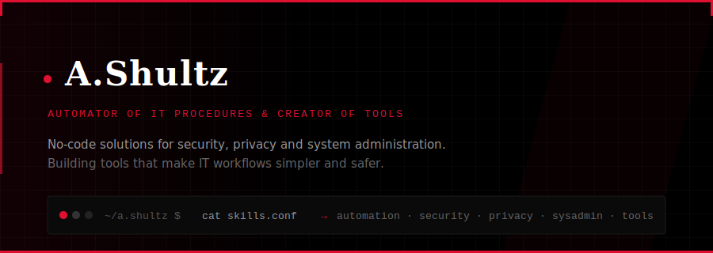

<br>

<table>
<tr>
<td width="50%" valign="top">

### 🔴 Now

- Building browser extensions for security auditing
- Writing about privacy tools & DPI bypass techniques
- Automating IT workflows with no-code solutions
- Running a [Telegram channel](https://t.me/besmertn1k) on IT tools & privacy

</td>
<td width="50%" valign="top">

### ◾ Stack

```
Automation    ██████████████████░░  90%
Security      ████████████████░░░░  80%
Python        ██████████████░░░░░░  70%
JavaScript    ████████████░░░░░░░░  60%
Linux/Bash    ████████████████░░░░  80%
```

</td>
</tr>
</table>

---

### Projects

| # | Project | Description | Tech |
|---|---------|-------------|------|
| 01 | **[Site Insight](https://github.com/besmertn1k/site-insight)** | Instant website security audit — IP, SSL, headers, tech stack, A-F grade | `Chrome` `MV3` `JS` |
| 02 | **[Telegram Channel](https://t.me/besmertn1k)** | IT tools, privacy, DPI bypass, system administration guides | `Content` `IT` |
| 03 | **OPSEC Guide** | Practical operational security for IT professionals | `PDF` `Security` |

---

<details>
<summary><b>◾ More about me</b></summary>
<br>

```yaml
name: A.Shultz
alias: besmertn1k
role: IT Automation & Tools
focus:
  - No-code solutions for security workflows
  - Privacy tools & system administration
  - Browser extensions & CLI utilities
  - Content creation for IT professionals
principles:
  - Automate everything that can be automated
  - Security is about behavior, not just tools
  - Build simple things that solve real problems
```

</details>

<details>
<summary><b>◾ Tech & tools I work with</b></summary>
<br>

**Languages & Runtime**


**Security & Privacy**


**Infrastructure**


**Tools**


</details>

---

<p>
<a href="https://t.me/besmertn1k">

</a>
&nbsp;
<a href="https://github.com/besmertn1k">

</a>
</p>

<sub>🔴 <i>Automate everything. Secure the rest.</i></sub>
